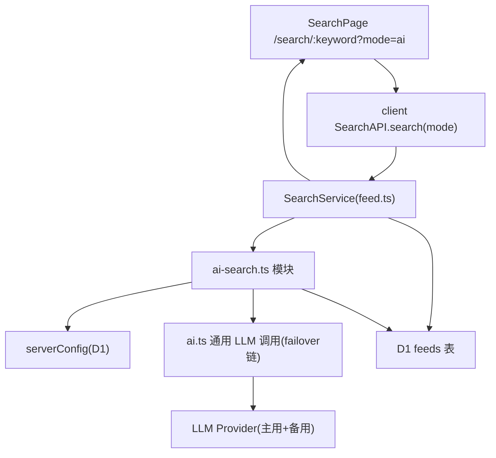

# AI 增强搜索（AI-Enhanced Search）

Feature Name: ai-enhanced-search
Updated: 2026-08-13

## Description

在现有基于 SQL `LIKE` 的关键字搜索之上新增「AI 增强搜索」模式。用户在搜索页可切换「关键字 / AI 增强」两种模式。AI 模式流程：先以关键词对文章做 `LIKE` 粗筛得到候选集，再将候选文章的标题、简介（summary）与 AI 总结（ai_summary）交给 LLM 做相关性筛选与排序，LLM 返回按相关性降序的文章 id 列表，后端按该顺序返回文章详情。LLM 配置完全复用 `ai_summary.*`（主用 + failover 备用链），可用性由新增独立开关 `ai_search.enabled` 控制。

## Architecture



架构说明：

- 搜索入口复用现有 `GET /api/search/:keyword`，新增 `mode=ai` 查询参数，`mode` 缺省为 `keyword`，保证旧行为不变。
- `SearchService`（server/src/services/feed.ts）在 `mode=ai` 时委托给新的 `server/src/utils/ai-search.ts` 模块。
- `ai-search.ts` 读取 `serverConfig` 判断可用性并构建候选，调用通用 LLM 执行函数（failover 链），解析结果并回查文章详情。
- 通用 LLM 执行函数由 `server/src/utils/ai.ts` 抽取：现有 `generateAISummaryResult` 内联的「主模型 + failover 依次尝试」逻辑抽象为可复用的执行器，供文章总结与 AI 搜索共用。

## Components and Interfaces

### 配置层

- `packages/config/src/index.ts` 新增：
  - `AI_SEARCH_ENABLED_KEY = "ai_search.enabled"`。
  - `DEFAULT_AI_SEARCH_ENABLED = false`。
- `server/src/utils/db-config.ts` 新增 `getAISearchEnabled(config)`，读取 `ai_search.enabled`，缺省返回 `false`。
- `server/src/services/config.ts` 的 `server.config` 读写已覆盖任意键，`ai_search.enabled` 作为普通配置键读写；无需修改敏感字段掩码逻辑（该键非敏感）。

### 后端接口

`GET /api/search/:keyword?mode=ai&page=&limit=`

响应结构（与 `FeedListResponse` 同构，新增两字段）：

```json
{
  "size": 10,
  "data": [ "Feed 对象（按 LLM 相关性降序）" ],
  "hasNext": false,
  "mode": "ai" | "keyword",
  "fallbackReason": "string（仅回退时存在，如 ai_search.disabled / ai_unconfigured / llm_failed）"
}
```

- `mode=ai` 且 AI 可用时：`mode: "ai"`，`data` 为 LLM 排序结果。
- 任何回退场景：`mode: "keyword"`，`data` 为关键字搜索结果，`fallbackReason` 说明原因。
- 分页语义：AI 模式仅支持第一页返回 LLM 排序后的 `limit` 条（默认 20）；`hasNext` 恒为 `false`。`page > 1` 的 AI 请求回退为关键字搜索。

### AI 检索模块（server/src/utils/ai-search.ts）

- `getAISearchCandidates(db, keyword, limit)`：复用现有 `or(like(...))` 粗筛，仅返回 `id`、`title`、`summary`、`ai_summary`、`alias`，`draft=0`，按 `createdAt`/`updatedAt` 降序，上限 50 条。
- `buildSearchPrompt(keyword, candidates)`：拼接候选文本块，要求 LLM 仅返回按相关性降序的 id JSON 数组。
- `parseSearchResult(raw)`：宽容解析 LLM 输出，提取 id 数组（支持纯 JSON 数组或代码块包裹），过滤无效 id。
- `runAISearch(env, serverConfig, db, keyword)`：
  1. `getAISearchEnabled` 为 false → 返回回退（`ai_search.disabled`）。
  2. 候选为空 → 返回空结果（不调用 LLM）。
  3. 读取 AI 配置（`getAIConfig`），`enabled` 为 false 或主模型不可用 → 回退（`ai_unconfigured`）。
  4. 调用通用 LLM 执行器（failover 链），失败 → 回退（`llm_failed`）。
  5. 按 LLM 返回 id 顺序回查文章详情并组装 `Feed`。

### 通用 LLM 执行器（server/src/utils/ai.ts 重构）

- 抽取 `executeAIWithFailover(env, serverConfig, messages, options: { maxTokens?, temperature? }): Promise<{ content: string; provider: string; model: string } | null>`。
- 内部复用现有「主配置 + failover 逐条尝试、记录错误、`stripReasoningTags` 清洗」逻辑。
- `generateAISummaryResult` 改为调用执行器，保持现有签名与行为（现有测试不受影响）。

### 前端

- `client/src/api/client.ts`：`SearchAPI.search` 增加 `mode?: "keyword" | "ai"` 参数，拼入 query。
- `client/src/page/search.tsx`：
  - 顶部增加「关键字 / AI 增强」模式切换控件，模式存 URL 参数 `mode`（缺省 `keyword`）。
  - AI 模式下请求 `mode=ai`，渲染 `fallbackReason` 提示（回退时展示关键字结果 + 原因文案）。
  - 页面加载时读取 server config 的 `ai_search.enabled`；关闭时禁用「AI 增强」模式并提示。
  - AI 模式隐藏下一页分页控件。
- `client/src/page/settings-ai.tsx`：
  - `AISettingsValue` 增加 `aiSearchEnabled: boolean`。
  - AI 总结设置卡片内新增「AI 搜索」开关行，读写 `ai_search.enabled`。
- `client/public/locales/{zh-CN,en,ja,zh-TW}/translation.json`：新增模式切换、AI 搜索开关、回退原因等文案。

## Data Models

- 无新增数据表。新增单一配置键 `ai_search.enabled`，存储于 D1 `cache` 表（`type='server.config'`，`key='ai_search.enabled'`，布尔值）。
- LLM 输出约定：候选文章 id 的 JSON 数组（如 `["uuid1","uuid2"]`），解析器做宽容处理。

## Correctness Properties

1. `mode=ai` 的响应 `mode` 字段必须为 `"ai"` 或 `"keyword"`，不得缺失。
2. AI 模式 `data` 顺序必须严格遵循 LLM 返回 id 顺序；LLM 返回 id 与候选交集外的不返回。
3. AI 模式不会因 LLM 失败抛出 5xx：所有失败路径收敛为 `mode:"keyword"` + `fallbackReason`。
4. 候选集上限 50、每篇文本字段截断，保证单次 LLM 调用 token 有界。
5. 关键字模式行为与现有一致（`mode` 缺省 `keyword`，无额外字段影响）。

## Error Handling

| 场景 | 处理 |
|------|------|
| `ai_search.enabled` 关闭 | 回退关键字搜索，`fallbackReason="ai_search.disabled"` |
| AI 总结未启用 / 未配置 | 回退关键字搜索，`fallbackReason="ai_unconfigured"` |
| 候选集为空 | 返回空结果（不调用 LLM） |
| 主用 LLM 失败 | 依次尝试 failover；全部失败则回退，`fallbackReason="llm_failed"` |
| LLM 输出无法解析 / id 无效 | 回退关键字搜索，`fallbackReason="llm_failed"` |
| `page > 1` 的 AI 请求 | 回退关键字搜索 |

## Test Strategy

- **服务端单元测试**（`server/src/utils/__tests__/ai-search.test.ts`）：
  - 候选粗筛与字段截断、空候选短路。
  - prompt 构造、LLM 输出解析（JSON 数组 / 代码块 / 垃圾前缀）。
  - failover 链复用：主用失败切备用、全部失败回退。
  - 开关关闭、AI 未配置等回退分支及 `fallbackReason`。
- **服务端集成测试**（`server/src/services/__tests__/feed.test.ts`）：`mode=ai` 成功、回退、空关键词、`mode` 缺省行为回归。
- **配置测试**（`server/src/services/__tests__/config.test.ts`）：`ai_search.enabled` 读写与缺省值。
- **前端测试**：`search.tsx` 模式切换与回退提示渲染；`settings-ai.tsx` AI 搜索开关读写。

## References

[^1]: (Filename#L497) - [SearchService /api/search/:keyword](server/src/services/feed.ts)
[^2]: (Filename#L213) - [generateAISummaryResult 主用+failover 逻辑](server/src/utils/ai.ts)
[^3]: (Filename#L124) - [getAIConfig](server/src/utils/db-config.ts)
[^4]: (Filename#L44) - [AI_CONFIG_PREFIX 与 DEFAULT_AI_CONFIG](packages/config/src/index.ts)
[^5]: (Filename#L585) - [SearchAPI.search](client/src/api/client.ts)
[^6]: (Filename#L19) - [SearchPage](client/src/page/search.tsx)
[^7]: (Filename#L27) - [AISettingsValue 与 AI 总结设置卡片](client/src/page/settings-ai.tsx)
