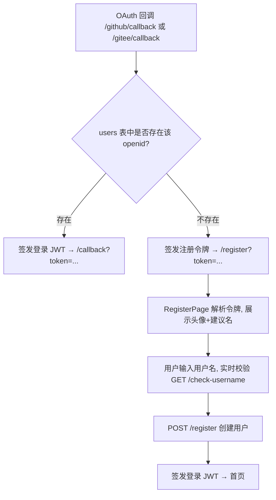

# OAuth 用户名唯一性设计

Feature Name: oauth-username-uniqueness
Updated: 2026-08-31

## Description

多第三方登录接入后，不同用户可能拥有相同用户名。本设计在数据库层为 `username` 加 UNIQUE 约束，并把 OAuth 新用户引流到一个专门的「创建新用户」页面，由用户设置全局唯一的用户名后再落库。已存在的第三方账号仍走原登录流程。

## Architecture



## Components and Interfaces

### 1. 数据库迁移 `server/sql/0011.sql`
按现有编号迁移约定（参考 `server/sql/0010.sql`）：
- 重建 `users` 表，列定义与现有一致（`id, username, openid, avatar, password, permission, created_at, updated_at`），其中 `username text NOT NULL UNIQUE`。
- 数据迁移时用窗口函数对重复 `username` 追加 `#N` 后缀：
  ```sql
  INSERT INTO users_new (id, username, openid, avatar, password, permission, created_at, updated_at)
  SELECT id,
    CASE WHEN ROW_NUMBER() OVER (PARTITION BY username ORDER BY id) = 1 THEN username
         ELSE username || '#' || ROW_NUMBER() OVER (PARTITION BY username ORDER BY id) END,
    openid, avatar, password, permission, created_at, updated_at
  FROM users;
  ```
- 末尾 `UPDATE info SET value = '11' WHERE key = 'migration_version';`
- 应用方式：沿用现有 `bun run db:migrate`（读取 `server/sql/*.sql` 并按 `migration_version` 顺序执行未应用的迁移）。

### 2. 注册令牌签发（修改 `server/src/services/user.ts`）
- 新增私有函数 `issueRegistrationToken(profile)`，使用与登录 JWT 相同的 `jwt.sign` 签发，payload 含 `{ openid, avatar, platform, suggestedUsername, type: "register" }`，`expiresIn` 设为短时效（建议 10 分钟）。
- 在 GitHub 与 Gitee 回调的「用户不存在」分支，将原来的直接 `insert` 改为调用 `issueRegistrationToken`，并重定向到 `/register?token=...`（取代原 `/callback?token=...`）。
- 已存在分支逻辑不变。

### 3. 用户名可用性校验接口（新增 `server/src/services/user.ts`）
- `GET /api/user/check-username?username=...`
- 查询 `db.query.users.findFirst({ where: eq(users.username, username) })`，返回 `{ available: boolean }`。
- 空/空白用户名返回 `available: false`。

### 4. 注册接口（新增 `server/src/services/user.ts`）
- `POST /api/user/register`，body：`{ token, username }`。
- 校验 `token` 为有效注册令牌（验签 + 未过期 + `type === "register"`）；否则 401。
- 校验 `username` 非空且未被占用；占用则 409。
- 若 `db.query.users.findMany({ limit: 1 })` 为空，则 `permission = 1`，否则 `0`。
- 用令牌中的 `openid`/`avatar` 与用户提交的 `username` 插入 `users`，返回登录 JWT（与既有登录一致的签发与 cookie 设置方式）。

### 5. 前端注册页（新增 `client/src/page/register.tsx`）
- 路由：在 `client/src/app/routes.tsx` 增加 `<AppRoute path="/register">` 指向 `RegisterPage`。
- 解析 `?token=`：用 `jwt.decode`（或后端 `/api/user/register` 在提交时由后端解析，前端仅展示令牌内的 avatar/建议名——为减少前端依赖，建议令牌内资料以可读字段附带，或增加一个 `GET /api/user/register/info?token=` 让前端取头像与建议名）。
- 展示头像（令牌内 `avatar`）+ 建议用户名（`suggestedUsername`）。
- 用户名输入框：onChange 防抖调用 `GET /api/user/check-username`，实时显示可用/占用。
- 提交：`POST /api/user/register`，成功后 `setAuthToken` 并跳转首页（或 `redirect_to`）。

### 6. 前端回调页（`client/src/page/callback.tsx`）
- 行为不变（读取 `?token=` 后跳首页）。仅当后端对「已存在用户」仍走 `/callback?token=` 时适用；新用户不再到达此页。

## Data Models

`users` 表（迁移后）：
| 列 | 类型 | 约束 |
|----|------|------|
| id | integer | PK |
| username | text | NOT NULL, **UNIQUE** |
| openid | text | NOT NULL |
| avatar | text | 可空 |
| password | text | 可空 |
| permission | integer | default 0 |
| created_at | integer | default unixepoch() |
| updated_at | integer | default unixepoch() |

注册令牌 payload：
```ts
{ openid: string; avatar: string; platform: "github" | "gitee"; suggestedUsername: string; type: "register"; exp: number }
```

## Correctness Properties

- 不变量 1：`users.username` 全局唯一（数据库 UNIQUE + 应用层插入前查重双重保障）。
- 不变量 2：同一 `openid` 始终映射到同一 `users.id`（既有逻辑，本次不改）。
- 不变量 3：注册令牌只能用于创建一次账号，且 10 分钟内有效；过期须重新走 OAuth。
- 迁移安全性：重复用户名在迁移中被确定性地后缀化，首条保留原名，不产生数据丢失。

## Error Handling

- 注册令牌无效/过期：`/register` 页面提示「链接已失效，请重新登录」，提供返回登录入口。
- 用户名被占用：`check-username` 返回 `available:false`，`/register` 提交被阻；`POST /register` 返回 409。
- OAuth 平台返回异常（无 openid/avatar）：回调按既有方式报错，不进入注册分支。
- 并发注册同名：数据库 UNIQUE 约束兜底，捕获唯一冲突返回 409，前端提示更换。

## Test Strategy

- **迁移测试**：在 `server/tests/` 构造含重复 `username` 的 `users` 数据，执行 `0011.sql` 后断言：UNIQUE 存在、重复项已被后缀化、首条原名保留、`migration_version=11`。
- **回调分流测试**（扩展 `server/src/services/__tests__/user.test.ts`）：
  - 已存在 `openid` → 重定向含 `/callback?token=`。
  - 不存在 `openid` → 重定向含 `/register?token=`（且令牌可验签、含 profile）。
- **check-username 测试**：占用名返回 `false`、可用名返回 `true`、空名返回 `false`。
- **register 接口测试**：正常创建并返回 JWT；同名 409；无效令牌 401；空库首个用户 `permission=1`，非空库 `permission=0`。
- **前端测试**（`client/src/page/__tests__/register.test.ts`）：渲染头像/建议名、输入占用名时禁止提交、提交成功跳转。

## References

[^1]: server/src/db/schema.ts#L65 - users 表定义（当前无 UNIQUE）
[^2]: server/src/services/user.ts#L234 - OAuth 回调按 openid 查人并直接 insert
[^3]: server/sql/0010.sql - 现有编号迁移范例（重建表 + 更新 migration_version）
[^4]: client/src/page/callback.tsx - 现有回调页读取 token 跳首页
[^5]: client/src/app/routes.tsx#L113 - 现有路由注册位置
