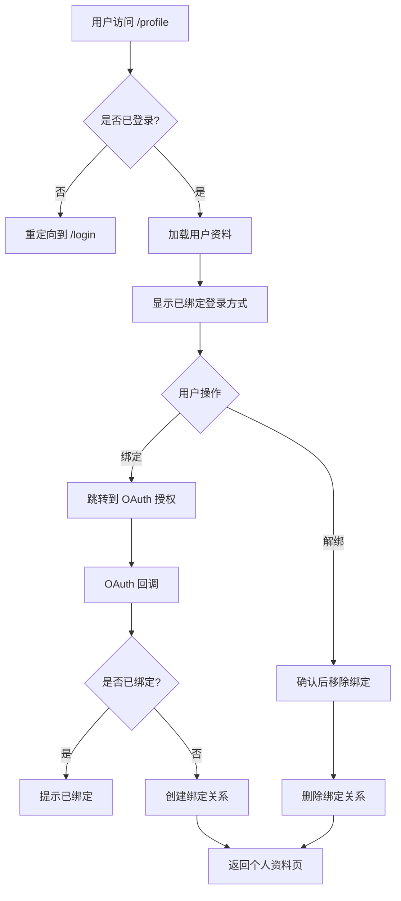
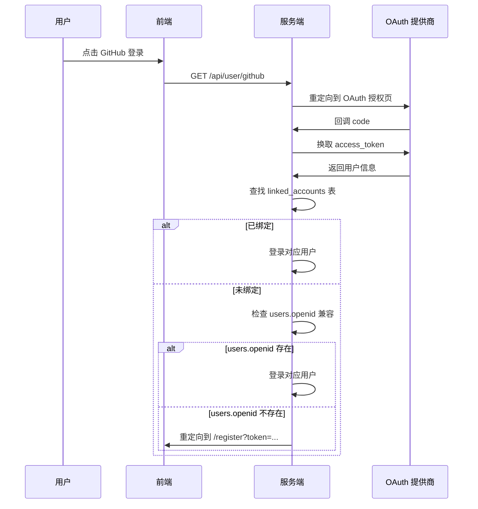

# [Feature Title] Profile Bind/Unbind Login Methods

Feature Name: profile-bind-unbind
Updated: 2026-09-04

## Description

允许用户在个人资料页面绑定和解绑其他登录方式（GitHub、Gitee、QQ、邮箱）。绑定后，用户可通过任一已绑定的方式登录同一账号；解绑后，该方式与当前账号脱钩。

## Architecture



## Components and Interfaces

### Backend APIs

#### GET /api/user/linked-accounts

获取当前用户已绑定的所有第三方账号列表。

**Response:**
```json
{
  "accounts": [
    {
      "provider": "github",
      "providerId": "12345",
      "username": "user_name",
      "avatar": "https://...",
      "linkedAt": "2024-01-01T00:00:00Z"
    },
    {
      "provider": "qq",
      "providerId": "qq:xxxxx",
      "linkedAt": "2024-01-02T00:00:00Z"
    }
  ]
}
```

#### POST /api/user/bind/{provider}

绑定第三方账号到当前用户。支持的 provider: `github`, `gitee`, `qq`, `email`。

**Request Body (email only):**
```json
{
  "email": "user@example.com"
}
```

**Response:**
```json
{
  "success": true,
  "provider": "github",
  "account": { ... }
}
```

**Error Responses:**
- `409 Conflict`: 该第三方账号已绑定至其他用户
- `400 Bad Request`: 参数错误或验证失败
- `401 Unauthorized`: 未登录

#### DELETE /api/user/unbind/{provider}

解绑当前用户的指定第三方账号。

**Response:**
```json
{
  "success": true,
  "provider": "github"
}
```

**Error Responses:**
- `403 Forbidden`: 尝试解绑唯一登录方式
- `404 Not Found`: 该账号未绑定
- `401 Unauthorized`: 未登录

### OAuth 流程适配

#### 绑定流程

1. 用户在个人资料页点击「绑定 GitHub」
2. 前端跳转到 `/api/user/github?bind=true`
3. 后端检测到 `bind=true` 参数，设置 `bind_mode=true` cookie
4. 正常走 OAuth 流程，callback 时检测 `bind_mode`
5. 如果 `bind_mode=true`，将 GitHub 账号绑定到当前登录用户（而非创建新用户或登录其他用户）
6. 回调成功后返回个人资料页，显示绑定成功

#### 解绑流程

1. 用户在个人资料页点击「解绑」
2. 前端显示确认对话框
3. 确认后调用 `DELETE /api/user/unbind/{provider}`
4. 后端检查是否还有其他登录方式
5. 如果是唯一登录方式，返回 403 拒绝解绑
6. 否则删除绑定关系，返回成功

## Data Models

### linked_accounts 表

```sql
CREATE TABLE linked_accounts (
    id INTEGER PRIMARY KEY AUTOINCREMENT,
    user_id INTEGER NOT NULL REFERENCES users(id) ON DELETE CASCADE,
    provider TEXT NOT NULL,  -- 'github', 'gitee', 'qq', 'email'
    provider_id TEXT NOT NULL,  -- 第三方平台用户ID
    linked_at INTEGER NOT NULL,  -- 绑定时间戳
    UNIQUE(user_id, provider, provider_id)
);
```

### users 表变更

无需变更现有 schema，通过 `linked_accounts` 表管理绑定关系。

### 登录流程变更



## Correctness Properties

1. **唯一性约束**：同一个第三方账号不能被绑定到多个用户
2. **安全解绑**：用户至少保留一种登录方式才能解绑
3. **绑定幂等性**：重复绑定同一账号返回成功但不创建重复记录
4. **OAuth 状态隔离**：绑定模式下的 OAuth 流程不影响普通登录流程

## Error Handling

| 场景 | HTTP 状态码 | 错误信息 |
|------|-------------|----------|
| 未登录访问绑定接口 | 401 | Authentication required |
| 绑定已被占用的账号 | 409 | Account already bound to another user |
| 解绑唯一登录方式 | 403 | Cannot unbind the only login method |
| 解绑未绑定的账号 | 404 | Account not linked |
| 邮箱格式错误 | 400 | Invalid email format |
| 数据库操作失败 | 500 | Internal server error |

## Test Strategy

### 单元测试
- 测试绑定流程：新用户绑定、已绑定用户重新绑定
- 测试解绑流程：成功解绑、拒绝解绑唯一登录方式
- 测试边界情况：重复绑定、解绑未绑定账号

### 集成测试
- 测试 OAuth 绑定流程完整链路
- 测试绑定后登录流程
- 测试解绑后登录流程

### 前端测试
- 测试个人资料页绑定/解绑 UI 交互
- 测试绑定状态显示

## References

- [^1]: `server/src/services/user.ts` - 现有 OAuth 登录逻辑
- [^2]: `server/src/services/auth.ts` - 认证服务
- [^3]: `server/src/db/schema.ts` - 数据库 schema
- [^4]: `client/src/page/profile.tsx` - 个人资料页面
- [^5]: `packages/api/src/types.ts` - API 类型定义
