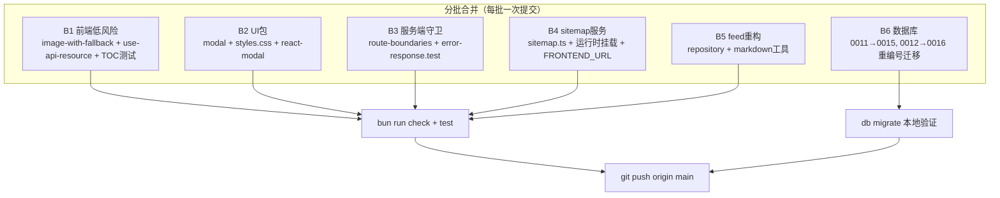
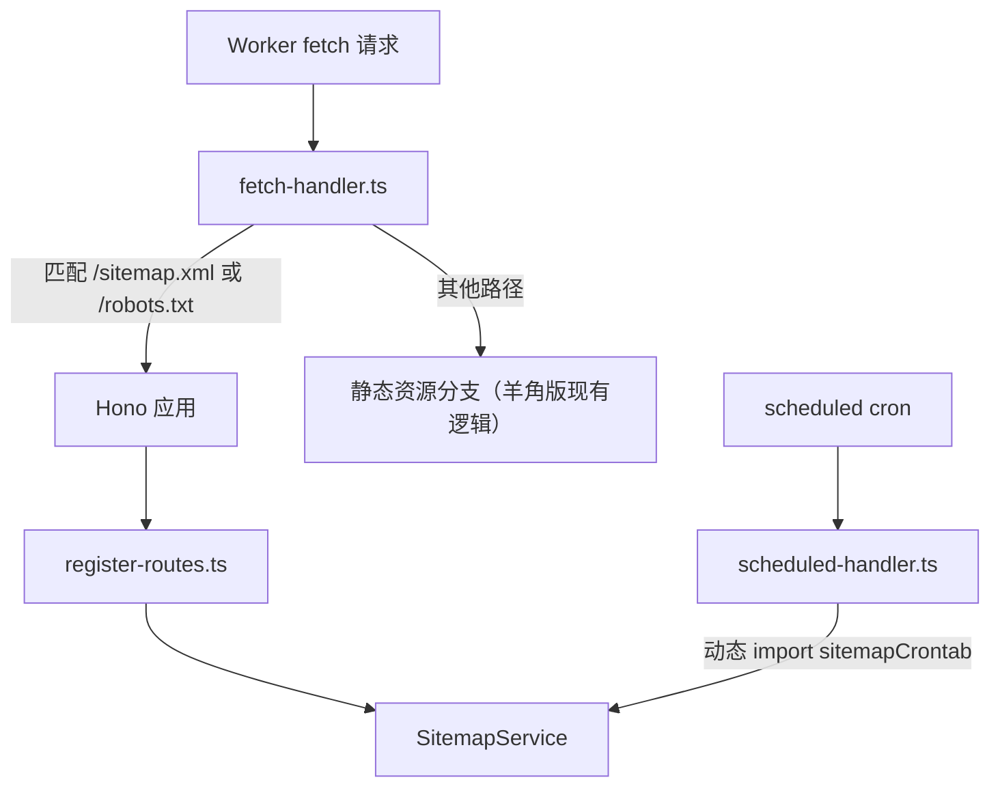

# 羊角快车版 Rin 同步原版新功能升级

Feature Name: upgrade-original-sync
Updated: 2026-09-27

## Description

将原版 OpenRin/Rin（`308a542`，2026-08-31）中的新功能吸收进羊角快车版（wool-hmq/Rin）。升级范围限定为原版新增的低风险新文件及其必要的接入文件改造；羊角快车版自有功能（邮箱登录、账号绑定、R2 管理、AI 增强搜索、多评论系统、AI 供应商定制等）全部保留。原版基准快照位于 `/tmp/Rin-original`。

原版新增内容清单（已核实）：

| 类别 | 文件 | 依赖接入点 |
|------|------|-----------|
| 前端组件 | `client/src/components/image-with-fallback.tsx` + 测试 | friends/feed/settings-items/moment_item/site-header 三组件/admin-layout/image-upload-input 共 8 处 |
| 前端 Hook | `client/src/hooks/use-api-resource.ts` + 测试 | queue-status、health 两页 |
| 前端 Hook 测试 | `client/src/hooks/__tests__/use-table-of-contents.test.tsx` | 现有 `useTableOfContents.tsx`（无需改源码，仅补测试） |
| UI 包 | `packages/ui/src/modal.tsx`、`styles.css`；package.json 增 `react-modal` | friends 页弹窗 |
| 服务端守卫 | `server/src/core/route-boundaries.ts` + 测试、`error-response.test.ts` | feed.ts、config.ts |
| sitemap 服务 | `server/src/services/sitemap.ts` + 测试 | register-routes、fetch-handler、scheduled-handler、custom-env.d.ts（`FRONTEND_URL`） |
| feed 仓库层 | `server/src/features/feed/repository.ts` | services/feed.ts |
| markdown 工具 | `server/src/utils/markdown.ts` + 测试 | services/feed.ts |
| 迁移 | 0011.sql（9 个索引）、0012.sql（feeds.top 修复 + 索引重建） | 需重编号为 0015/0016 |

羊角快车版自有文件在升级中受影响的高危文件（必须保留本地改动）：`services/feed.ts`、`services/config.ts`、`runtime/fetch-handler.ts`、`packages/api/*`、`client/src/page/settings-*.tsx`、`client/src/app/routes.tsx`。

## Architecture

升级采用「按功能单元分批合并 + 每批验证」策略，不引入新运行时架构，只做代码吸收：

sitemap 挂载后的运行时请求路径：

## Components and Interfaces

### B1 前端低风险吸收

- 新增：`image-with-fallback.tsx`、`use-api-resource.ts` 及两个测试文件、`use-table-of-contents.test.tsx`（原样复制，检查相对导入路径一致）。
- 接入：8 个使用图片回退的文件采用「原版 hunk + 羊角版本地 hunk」三方合并；queue-status/health 改用 Hook。
- 冲突预判：`feed.tsx`、`moment_item.tsx`、`admin-layout.tsx`、`settings-items.tsx`、`site-header/primitives/*` 均在羊角版改动清单中，预计冲突，需逐 hunk 询问用户。

### B2 UI 包 Modal

- 复制 `packages/ui/src/modal.tsx`、`styles.css`；`packages/ui/package.json` 增 `react-modal` 依赖与 `./styles.css` 导出、`@types/react-modal` devDep；`packages/ui/src/index.ts` 导出 Modal。
- friends 页合并原版 Modal 用法，保留羊角版本地改动。

### B3 路由边界守卫

- 新增 `route-boundaries.ts` + `route-boundaries.test.ts` + `error-response.test.ts`。
- feed.ts/config.ts 引入 `adminOnly/userOnly/withJsonBody`：先 `git diff` 羊角版相对原版基线的自有改动清单，逐段合并。羊角版 `config.ts` 的 `test-ai` 端点、`feed.ts` 的 AI 搜索端点必须完整保留。

### B4 sitemap 服务

- 新增 `sitemap.ts` + `sitemap.test.ts`。
- `fetch-handler.ts`：在羊角版现有逻辑基础上加入 `APP_META_ROUTE_PATTERN` 判断（羊角版此文件有 51 行差异，逐 hunk 合并）。
- `scheduled-handler.ts`：加入 `sitemapCrontab` 动态 import（差异仅 4 行，低风险）。
- `register-routes.ts`：挂载 SitemapService。
- `custom-env.d.ts`：新增 `FRONTEND_URL?: string`。
- 同步更新 `docs/docs/zh/env.md`、`docs/docs/en/env.md`（遵循文档同步约定）。
- 决策点：羊角版已有静态 `client/public/robots.txt`；动态 robots 路由优先级更高会遮蔽静态文件。需用户决策：删除静态文件改用动态生成，或保留静态文件并跳过 robots 动态部分。

### B5 feed 仓库层与 markdown 工具

- 新增 `features/feed/repository.ts`、`utils/markdown.ts` + `markdown.test.ts`。
- `services/feed.ts` 三方合并：原版把查询逻辑迁入 repository、调用 `adminOnly` 守卫、用 `stripMarkdown` 生成摘要；羊角版在此文件叠加了 AI 增强搜索等改动。合并顺序：先吸收原版结构性改动，再重新套用羊角版功能改动。
- 预判此文件冲突最重，为全流程最高风险点；合并后必须跑 `feed.test.ts`、`search.test.ts`、`ai-search.test.ts`。

### B6 数据库迁移重编号

- 原版 `0011.sql`（9 个索引）→ 羊角版 `0015.sql`；原版 `0012.sql`（feeds.top 修复 + 索引重建）→ 羊角版 `0016.sql`。
- 两个文件末尾 `UPDATE info SET value='12'` 改为 `value='15'` / `value='16'`。
- 原版 0012 依赖的 CLI 迁移预检（feeds-top 修复的 conditional check 在 `cli/src/tasks/db-migrate-local.ts` / `cli/src/lib/db-migration.ts`）需一并比对：羊角版这两个 CLI 文件有本地改动，冲突时询问用户。
- 本地验证：`bun run db:migrate` 后确认 `migration_version=16`。

## Data Models

无新增业务表。涉及变更：

- `info.migration_version`：14 → 16。
- 新增索引（0015）：`feeds_alias_idx`、`feeds_visibility_order_idx`、`feeds_uid_idx`、`visits_feed_created_at_idx`、`friends_accepted_order_idx`、`users_openid_idx`、`comments_feed_created_at_idx`、`hashtags_name_idx`、`feed_hashtags_feed_hashtag_idx`、`feed_hashtags_hashtag_feed_idx`、`cache_type_key_idx`。
- 0016：条件修复 `feeds.top`、重建 `feeds_visibility_order_idx`。
- 环境变量：新增可选 `FRONTEND_URL`（Worker 侧，sitemap/robots 基准地址，缺省回退请求 origin）。

## Correctness Properties

1. 羊角快车版全部自有功能文件（`.monkeycode/specs` 六个规格对应的功能）在升级后行为不变。
2. 任一合并提交后 `bun run check` 通过（type check）。
3. 客户端 Vitest 与服务端 bun test 全部通过。
4. 每个功能单元一个独立提交，`git revert <commit>` 可单独回退该单元。
5. 迁移执行后 `migration_version=16`，重复执行幂等（原版迁移均使用 IF NOT EXISTS / DROP IF EXISTS 模式）。

## Error Handling

| 场景 | 处理 |
|------|------|
| 三方合并 hunk 冲突 | 暂停该文件，向用户展示双方差异与候选方案，等待决策；未决策则标记「待决策」跳过 |
| 依赖安装失败（react-modal） | 重试 bun install；仍失败则回退 B2 整批并报告 |
| 迁移执行失败 | 停在当前批次，输出 D1 错误原文，询问用户是否回滚该迁移文件 |
| 合并后测试失败 | 修复后重跑；无法修复时回退该批次提交并询问用户 |
| 测试框架差异（原版客户端 hook 测试若为 bun:test 风格） | 比对羊角版 `client/src/test/setup.ts` 与 vitest 配置，必要时转换测试导入风格；不确定时询问用户 |

## Test Strategy

- 每批次完成后运行：`bun run check`（turbo type check）。
- 前端：`cd client && bun run test`（Vitest）。重点：image-with-fallback、use-api-resource、use-table-of-contents 新测试 + 既有 auth-redirect、bootstrap-config、site-header 测试。
- 服务端：`cd server && bun run test`（bun:test）。重点：route-boundaries、error-response、sitemap、markdown、feed、config、ai-summary、ai-search、linked-accounts、r2-service。
- 迁移：`bun run db:migrate` 本地 D1 验证 + `migration_version` 断言。
- 终验：`bun run build:client` 与 wrangler dry-run 构建通过。

## References

[^1]: (Directory) - 原版基准快照 /tmp/Rin-original（OpenRin/Rin @ 308a542）
[^2]: (Filename) - 对比清单会话记录：羊角版相对原版改动 133 文件、村长版 124 文件
[^3]: (server/sql/0013.sql, 0014.sql) - 羊角版自有迁移，迁移版本基线 14
[^4]: (.monkeycode/specs/comment-system-order/) - 评论系统规格，升级时验证其行为不变的回归基线
